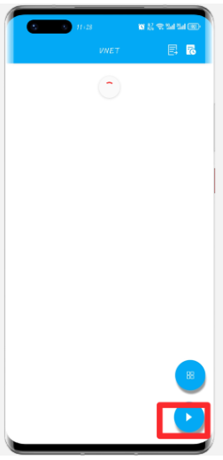
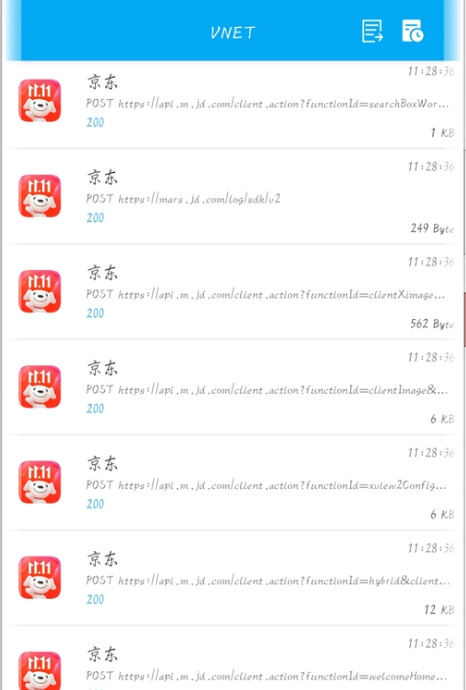
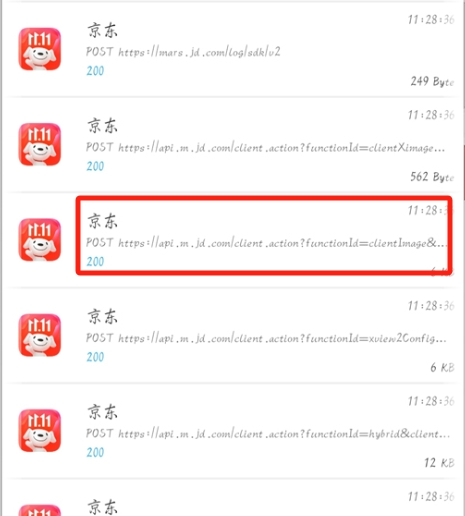
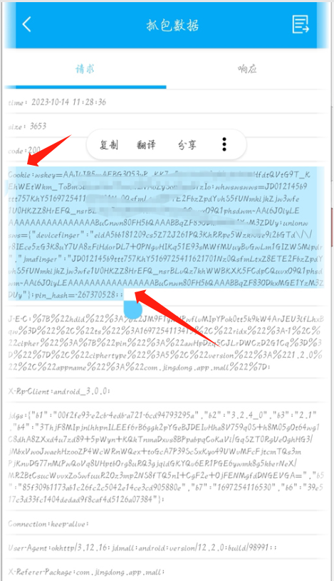
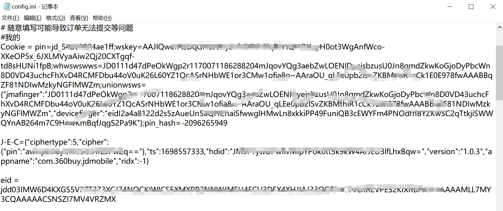

# 安卓抓包教程

## 安卓手机下载`vnet`软件
- <a href='https://www.vnet-tech.com/zh/'>VNET下载地址<a/>
- 安装到手机上,先下载ca证书,点击开始抓包即可保存证书。 
- 然后进入手机设置，搜索`证书`,进行证书安装，这里每个品牌手机具体路径不一致，这里就不一一描述。
- 安装完成之后，返回到vnet软件，点击开始抓包，进入京东APP,点击`我的`,点击`首页`,来回可多点击几次，返回vnet,查看页面是否有结果，成功结果如下图。 

- 找到`api.m.jd.com`这样的请求，点击进入详情页，找到cookies,这就是抓取的用户信息，复制到配置文件即可。  

- 这里需要注意的是，由于手机型号不同，抓取cookie时看看详情页的cookies是否完全显示，部分手机只显示部分，若只显示部分，重新抓取即可。
- 完整的cookie结构如上图所示。
- 配置文件样例： 

- 手机抓取的cookie不带`pin=`,可自行添加即可，pin值为京东账号名称，具体可在京东app个人信息页查询。

## 特别说明
* 抓取的cookie可以带分号`;`
* J-E-C末尾不能带分号
* User-Agent可以带分号`;`

